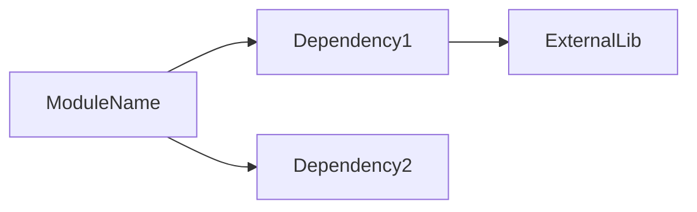

# SPEC — [MODULE_NAME]
**[Fecha:** YYYY-MM-DD] | **Versión:** 1.0 | **Estado:** DRAFT/APPROVED**

---

## 1. RESUMEN EJECUTIVO

[Una descripción de máximo 3 líneas de qué hace este módulo y por qué es necesario.]

**Pertenece a:** Fase X | **Depende de:** [Lista de specs prerequisites]
**Bloquea:** [Lista de specs que dependen de esta]

---

## 2. OBJETIVOS

| # | Objetivo | Métrica de éxito |
|---|----------|------------------|
| O1 | [Objetivo principal] | [Métrica medible] |
| O2 | [Objetivo secundario] | [Métrica medible] |

---

## 3. ESPECIFICACIÓN TÉCNICA

### 3.1 Interfaz pública

```python
class ModuleName:
    def method1(self, param: Type) -> ReturnType:
        """Docstring obligatorio para cada método público."""
        ...

    @property
    def property_name(self) -> Type:
        """Descripción de la propiedad."""
        ...
```

### 3.2 Tipos de datos

| Tipo | Descripción | Validador |
|------|-------------|-----------|
| Signal | Objeto de señal de trading | `SignalValidator` |
| Portfolio | Estado del portfolio | `PortfolioValidator` |

### 3.3 Casos de uso

| UC | Descripción | Input | Output | Excepciones |
|----|------------|-------|--------|-------------|
| UC1 | [Caso de uso principal] | `Request` | `Response` | `ValidationError` |
| UC2 | [Caso de uso secundario] | `Request` | `Response` | `TimeoutError` |

---

## 4. DISEÑO DETALLADO

### 4.1 Estructura de datos

```python
@dataclass
class OutputData:
    field1: str
    field2: float
    confidence: float  # 0.0 a 1.0
```

### 4.2 Algoritmos

**Algoritmo principal:**

1. [Paso 1]
2. [Paso 2]
3. [Paso 3]

**Complejidad:** O(n) | **Espacio:** O(n)

### 4.3 Dependencias



| Dependencia | Tipo | Justificación |
|-------------|------|---------------|
| core.risk.kill_switch | Interno | Control de riesgo |
| pydantic | Externo | Validación de datos |

---

## 5. CRITERIOS DE ACEPTACIÓN

| ID | Criterio | Test asociado |
|----|----------|---------------|
| CA-1 | [Criterio verificable 1] | `tests/unit/test_module.py::test_case_1` |
| CA-2 | [Criterio verificable 2] | `tests/unit/test_module.py::test_case_2` |

### 5.1 Tests obligatorios

```python
# tests/unit/test_module.py

def test_module_method_success():
    """CA-1: Método retorna resultado esperado."""
    ...

def test_module_validation_error():
    """CA-2: ValidationError cuando input inválido."""
    ...

async def test_module_integration():
    """CA-3: Integración con dependencias."""
    ...
```

---

## 6. RIESGOS Y MITIGACIONES

| Riesgo | Probabilidad | Impacto | Mitigación |
|--------|--------------|---------|------------|
| [Riesgo 1] | Media | Alto | [Estrategia de mitigación] |

---

## 7. CONSIDERACIONES DE RENDIMIENTO

- **Latencia objetivo:** < 100ms P95
- **Throughput:** > 1000 req/s
- **Memoria:** < 500MB

---

## 8. SEGURIDAD

| Aspecto | Requisito |
|---------|-----------|
| Autenticación | JWT con scopes apropiados |
| Rate limiting | Por endpoint (configurable) |
| Validación | Pydantic en todos los inputs |

---

## 9. TRAZABILIDAD

| Version | Fecha | Cambios | Autor |
|---------|-------|---------|-------|
| 1.0 | YYYY-MM-DD | Versión inicial | [Nombre] |

**APROBADO POR:** [Nombre] | **FECHA:** YYYY-MM-DD

---

*Esta spec sigue el sistema de Spec-Driven Development definido en el PLAN_MAESTRO_EJECUCION_2026-05-16. Ningún PR sin spec aprobada.*